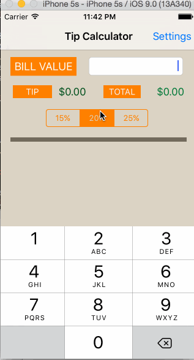

# Pre-work - Tip Calculator

Tip Calculator is a tip calculator application for iOS.

Submitted by: Kavin Arasu

Time spent: 5 hours spent in total

## User Stories

The following **required** functionality is complete:

* [x] User can enter a bill amount, choose a tip percentage, and see the tip and total values.
* [x] Settings page to change the default tip percentage.

The following **optional** features are implemented:
* [x] UI animations
* [ ] Remembering the bill amount across app restarts (if <10mins)
* [ ] Using locale-specific currency and currency thousands separators.
* [x] Making sure the keyboard is always visible and the bill amount is always the first responder. This way the user doesn't have to tap anywhere to use this app. Just launch the app and start typing.

The following **additional** features are implemented:

* [ ] List anything else that you can get done to improve the app functionality!
  - [x] Dining in group? Enable 'Split Group' in setting to split the bill total among your friends.

## Video Walkthrough 

Here's a walkthrough of implemented user stories:

GIF created with [LiceCap](http://www.cockos.com/licecap/).

## Notes

Describe any challenges encountered while building the app.

Having been used to mostly Java programming, it was interesting to learn the syntax of Objective-C. It was quite different. I am also surprised by the transitions in iOS programming in the past few years. It looks different from what I saw a couple of years back especially the storyboard.
## License

    Copyright 2015 Kavin Arasu

    Licensed under the Apache License, Version 2.0 (the "License");
    you may not use this file except in compliance with the License.
    You may obtain a copy of the License at

        http://www.apache.org/licenses/LICENSE-2.0

    Unless required by applicable law or agreed to in writing, software
    distributed under the License is distributed on an "AS IS" BASIS,
    WITHOUT WARRANTIES OR CONDITIONS OF ANY KIND, either express or implied.
    See the License for the specific language governing permissions and
    limitations under the License.
